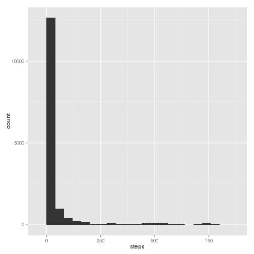

# Reproducible Research: Peer Assessment 1


## Loading and preprocessing the data

```r
unzip(zipfile = "./activity.zip")
data <- read.csv(file = "./activity.csv")
data$date <- as.Date(data$date)
summary(data)
```

```
##      steps            date               interval   
##  Min.   :  0.0   Min.   :2012-10-01   Min.   :   0  
##  1st Qu.:  0.0   1st Qu.:2012-10-16   1st Qu.: 589  
##  Median :  0.0   Median :2012-10-31   Median :1178  
##  Mean   : 37.4   Mean   :2012-10-31   Mean   :1178  
##  3rd Qu.: 12.0   3rd Qu.:2012-11-15   3rd Qu.:1766  
##  Max.   :806.0   Max.   :2012-11-30   Max.   :2355  
##  NA's   :2304
```


## What is mean total number of steps taken per day?

```r
library(ggplot2)
qplot(steps, data = data, geom = "histogram")
```

```
## stat_bin: binwidth defaulted to range/30. Use 'binwidth = x' to adjust this.
```

 

```r
# not clear if we have to cut by day... mn <- aggregate(steps ~
# cut(data$date, 'day'), data=data, FUN=mean, na.rm=T) md <- aggregate(steps
# ~ cut(data$date, 'day'), data=data, FUN=median, na.rm=T)
print(paste("Mean steps per day is ", mean(data$steps, na.rm = T)))
```

```
## [1] "Mean steps per day is  37.3825995807128"
```

```r
print(paste("Median steps per day is ", median(data$steps, na.rm = T)))
```

```
## [1] "Median steps per day is  0"
```


## What is the average daily activity pattern?

```r
y <- list(as.factor(data$interval))
mean.by.5 <- aggregate(data$steps, y, mean, na.rm = T)
names(mean.by.5) <- c("interval", "mn")
plot(mean.by.5$interval, mean.by.5$mn, type = "n")
lines(mean.by.5$interval, mean.by.5$mn)
max.point <- mean.by.5[which(mean.by.5$mn == max(mean.by.5$mn)), ]
points(max.point, pch = 4, cex = 2, col = "red")
```

 

```r
print(paste("5'-interval with max steps in avg across all days:", max.point$interval, 
    "with ", max.point$mn, "steps in average", sep = " "))
```

```
## [1] "5'-interval with max steps in avg across all days: 835 with  206.169811320755 steps in average"
```


## Imputing missing values


## Are there differences in activity patterns between weekdays and weekends?
